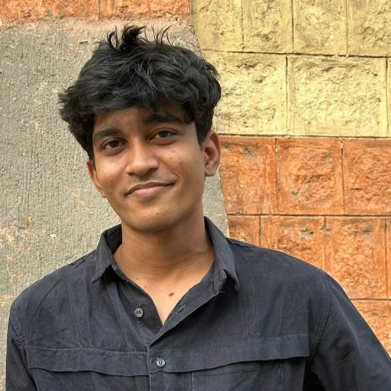
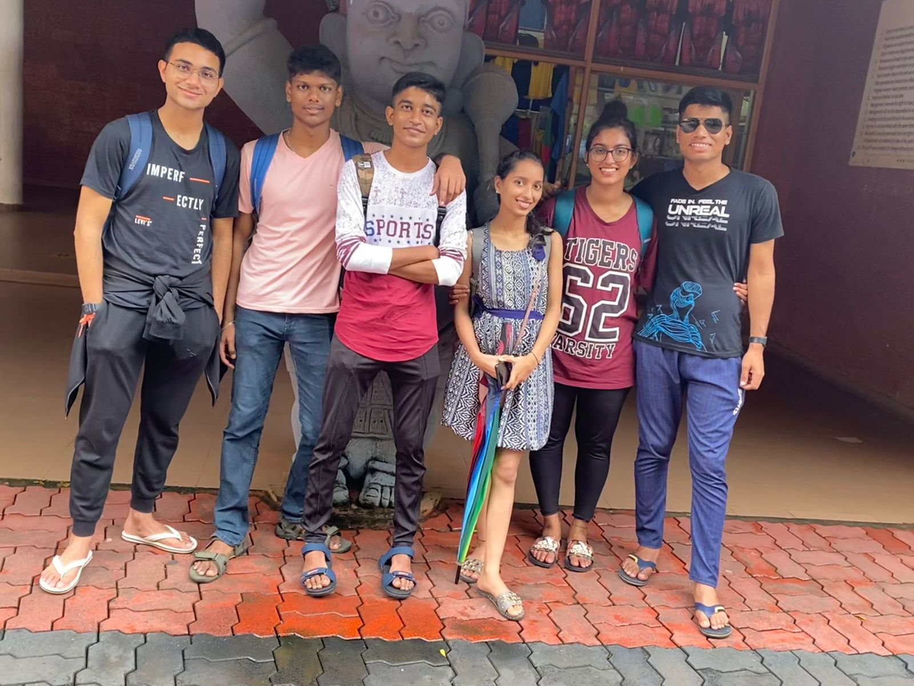

#### *Engineer & Tinkerer*

I'm **Dikshit**, Engineer and Tinkerer.

I graduated from NIT Calicut in 2024 with a degree in Mechanical Engineering. Right now, I'm on this journey trying to figure out my "why" - that's basically what drives all my tinkering.

I've dabbled in a bunch of stuff - coding, AI, robotics, drones, renewable energy, and FOSS.

Outside of tech, I'm into dancing (especially garba - it's the best!), photography, hiking, and running. I also volunteer with a few non-profits and practice yoga regularly.

Back in school, I was a decent student. I found out about JEE by chance through my school, and somehow clearing it landed me in a pretty good college. College was a game-changer though - it completely shifted how I saw the opportunities around me. I was lucky to have some amazing friends who really shaped who I am and how I think.

    

Since childhood, I dreamed of becoming an Air Force aviator, which is why I joined the NCC air wing in 9th grade. I continued with the Naval NCC unit in college, chasing that dream.

However, this Dream remains unfulfilled, as I failed in both my attempts to join the Indian Air Force.

I am fortunate to be in a position where what I do every day is exactly what I have unconditionally enjoyed doing - Building, Tinkering, and Experimenting.

Lately, I have been sharing my thoughts through Social Media, and Blog Posts. This website is a collection of my Musings, the insights I've gained that I want to share, especially for those Building Businesses.

I can be reached at [dikshitdesign@gmail.com](mailto:dikshitdesign@gmail.com).

*Last updated on 15th May 2026*.